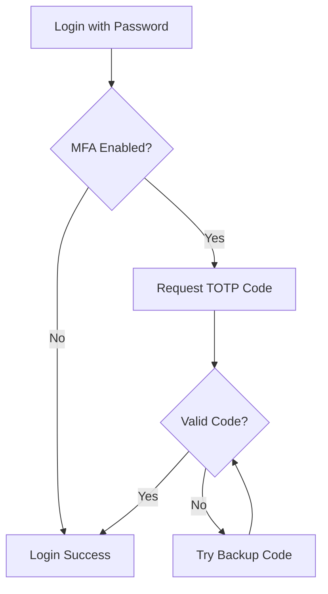

<div align="center">

# 🛡️ Security Overview

### _Enterprise-Grade Security Architecture_

[](https://github.com/Farzync/azyqs-auth)
[](https://github.com/Farzync/azyqs-auth)
[](https://github.com/Farzync/azyqs-auth)
[](https://github.com/Farzync/azyqs-auth)

_Comprehensive security model with real-time monitoring and advanced threat protection_

[🔐 Authentication Flow](#-authentication-flow) • [🛡️ Security Features](#️-security-features) • [📊 Audit System](#-audit-system) • [💡 Best Practices](#-best-practices)

---

</div>

## 🎯 **Security Philosophy**

> **"Security by design, transparency by default"**

Azyqs-Auth implements a **zero-trust security model** with comprehensive logging, multi-layered protection, and real-time monitoring. Every action is validated, logged, and protected against common attack vectors.

### 🏆 **Security Highlights**

<table>
<tr>
<td width="50%">

🔒 **Zero-Trust Architecture**  
🛡️ **Multi-Factor Authentication**  
🚦 **Rate Limiting on Login/MFA/Backup Code**  
🔑 **Passwordless Authentication**  
📊 **Real-time Audit Logging**

</td>
<td width="50%">

🚫 **CSRF Protection**  
🤖 **Bot Prevention (reCAPTCHA)**  
🔐 **Secure Session Management**  
⚡ **Threat Detection & Response**

</td>
</tr>
</table>

---

## 🔐 **Authentication Flow**

### 1. 📝 **User Registration**

<details>
<summary><b>🔍 Security Implementation Details</b></summary>

**Input Validation & Protection:**

```typescript
✅ Zod schema validation (server-side, type-safe)
✅ CSRF token verification required
✅ Google reCAPTCHA v3 validation
✅ Password strength enforcement
✅ Duplicate email/username prevention
```

**Security Measures:**

- 🔐 **Password Hashing:** bcryptjs with strong salt rounds
- 🚫 **Rate Limiting:** Prevent registration abuse
- 📊 **Audit Logging:** All attempts logged with device/IP tracking
- 🛡️ **Data Sanitization:** Input cleaning and validation

</details>

**Flow Diagram:**

```
Registration Request → CSRF Check → reCAPTCHA → Validation → Hash Password → Store User → Audit Log
```

---

### 2. 🚪 **User Login**

<details>
<summary><b>🔍 Multi-Layer Authentication Process</b></summary>

**Primary Authentication:**

```typescript
✅ Credential validation (username/email + password)
✅ CSRF token verification
✅ reCAPTCHA validation
✅ Password verification with bcryptjs
```

**Secondary Authentication (if enabled):**

```typescript
✅ TOTP code verification (6-digit)
✅ Backup code verification (one-time use)
✅ WebAuthn/Passkey authentication
```

**Session Management:**

```typescript
✅ JWT token generation with secure claims
✅ HttpOnly, Secure cookie storage
✅ Session expiration and refresh logic
```

</details>

**Authentication Matrix:**

| Method          | Primary Auth | Secondary Auth | Passwordless |
| --------------- | ------------ | -------------- | ------------ |
| **Traditional** | ✅ Password  | ❌             | ❌           |
| **MFA Enabled** | ✅ Password  | ✅ TOTP/Backup | ❌           |
| **WebAuthn**    | ❌           | ❌             | ✅ Passkey   |

---

### 3. 🔐 **Multi-Factor Authentication (MFA)**

#### Setup Process

<table>
<tr>
<td width="60%">

**🚀 TOTP Setup Flow:**

1. Generate cryptographic secret
2. Display QR code for authenticator app
3. Verify setup with test code
4. Generate secure backup codes
5. Enable MFA protection

</td>
<td width="40%">

**🛡️ Security Features:**

- ✅ Time-based codes (30s window)
- ✅ One-time backup codes
- ✅ Secure secret generation
- ✅ Fallback mechanisms

</td>
</tr>
</table>

#### Verification Process



**Backup Code Management:**

- 🔐 **Secure Generation:** Cryptographically strong codes
- 🚫 **One-Time Use:** Deleted after successful use
- 🔄 **Smart Regeneration:** Only available when MFA is active
- 📊 **Full Audit Trail:** Every action logged

---

### 4. 🗝️ **WebAuthn (Passkey) Authentication**

#### Registration Flow

<details>
<summary><b>🔧 Technical Implementation</b></summary>

**Client-Side Process:**

```javascript
1. Generate WebAuthn challenge
2. User gesture (biometric/PIN)
3. Create credential keypair
4. Return attestation to server
```

**Server-Side Verification:**

```javascript
1. Validate attestation format
2. Verify challenge response
3. Store public key credential
4. Associate with user account
```

</details>

#### Authentication Benefits

| Traditional Login   | WebAuthn Login     |
| ------------------- | ------------------ |
| Password + MFA      | Biometric/PIN only |
| Multiple steps      | Single gesture     |
| Phishing vulnerable | Phishing resistant |
| Password management | No passwords       |

---

## 🛡️ **Security Features**

### Core Protection Systems

<div align="center">

| Security Layer           | Implementation                                                    | Protection Level |
| ------------------------ | ----------------------------------------------------------------- | ---------------- |
| **🚦 Rate Limiting**     | Login, MFA & backup code: 5 failed attempts per 5 min per user/IP | High             |
| **🚫 CSRF Protection**   | Token-based validation                                            | High             |
| **🤖 Bot Prevention**    | reCAPTCHA v3                                                      | Medium           |
| **🔐 Password Security** | bcryptjs + salt                                                   | High             |
| **🍪 Session Security**  | JWT + HttpOnly cookies                                            | High             |
| **📊 Audit Logging**     | Real-time monitoring                                              | Critical         |
| **⚡ Input Validation**  | Zod schemas                                                       | High             |

</div>

### Advanced Security Measures

#### 🔒 **Encryption & Hashing**

```typescript
// Password Security
✅ bcryptjs with 12+ salt rounds
✅ Secure random salt generation
⏳ Timing attack prevention

// Session Security
✅ JWT with HS256 algorithm
✅ Secure secret key (256-bit+)
⏳ Short expiration times
```

#### 🛡️ **Attack Prevention**

```typescript
// Common Attack Vectors
✅ SQL Injection (Prisma ORM protection)
✅ XSS (Input sanitization + CSP)
✅ CSRF (Token validation)
✅ Brute Force (Rate limiting on login, MFA, and backup code verification)
⏳ Session Fixation (Token rotation)
```

---

## 📊 **Audit System**

### Real-Time Security Monitoring

> **Every security event is tracked, logged, and made available for analysis**

#### Logged Events Matrix

<table>
<tr>
<th>Category</th>
<th>Events</th>
<th>Data Captured</th>
</tr>
<tr>
<td><b>🔐 Authentication</b></td>
<td>Login, Logout, Failed attempts</td>
<td>IP, Device, Method, Status, Errors</td>
</tr>
<tr>
<td><b>👤 Account Management</b></td>
<td>Profile updates, Password changes</td>
<td>Changes made, Timestamp, Source</td>
</tr>
<tr>
<td><b>🛡️ Security Actions</b></td>
<td>MFA setup/disable, Passkey management</td>
<td>Action type, Success/Failure, Details</td>
</tr>
<tr>
<td><b>🔑 Access Control</b></td>
<td>Permission changes, Admin actions</td>
<td>Previous/New state, Authorization</td>
</tr>
</table>

#### Interactive Audit Features

**🔍 Real-time Filtering:**

```typescript
✅ Filter by latest date range
✅ Filter by success/failure
```

**📈 Security Analytics:**

- Failed login attempt patterns
- Unusual access locations
- Device fingerprinting
- Suspicious activity detection

---

## 🔧 **Implementation Details**

### Code Structure

```
📂 Security Implementation
├── 📁 /src/server/auth/          # Authentication logic
│   ├── login.ts                  # Login flow & validation
│   ├── register.ts              # Registration security
│   ├── mfa/                     # MFA implementation
│   └── webauthn/                # WebAuthn handlers
├── 📁 /src/server/user/          # User management
│   ├── getProfile.ts               # Profile security
│   ├── changePassword.ts        # Change Password
│   └── auditLogUser.ts          # Audit logging
```

### Database Security

**🔒 Secure Data Storage:**

```sql
-- Sensitive data protection
✅ Passwords: bcrypt hashed
✅ Backup codes: SHA-256 hashed
✅ TOTP secrets: AES encrypted
✅ Session tokens: Signed JWTs
✅ Audit logs: Immutable records
```

---

## 🚨 **Threat Detection & Response**

### Automated Security Monitoring

<div align="center">

| Threat Type                              | Detection Method                                  | Response              |
| ---------------------------------------- | ------------------------------------------------- | --------------------- |
| **🚨 Brute Force**                       | Failed attempt tracking (login, MFA, backup code) | Audit Logged          |
| **🌍 Location Anomaly** (Coming Soon)    | IP geolocation analysis                           | Email notification    |
| **🔓 Credential Stuffing** (Coming Soon) | Pattern recognition                               | Enhanced verification |

</div>

### Security Alerts

**Real-time Notifications:**

- 📧 **Email Alerts:** Suspicious login attempts (⏳Coming Soon⏳)
- 📱 **In-app Notifications:** Security setting changes (⏳Coming Soon⏳)

---

## 💡 **Best Practices & Recommendations**

### 🏗️ **Deployment Security**

<table>
<tr>
<td width="50%">

**🔒 Production Checklist:**

- ✅ Always use HTTPS (TLS 1.3+)
- ✅ Strong JWT secrets (256-bit+)
- ✅ Environment variable protection
- ✅ Regular secret rotation
- ✅ Database connection encryption

</td>
<td width="50%">

**⚡ Performance Security:**

- ✅ Rate limiting implementation
- ✅ DDoS protection setup
- ✅ CDN security headers
- ✅ Database query optimization
- ✅ Session cleanup jobs

</td>
</tr>
</table>

### 📊 **Monitoring & Maintenance**

**Daily Operations:**

```bash
# Security monitoring commands
✅ Monitor audit logs for anomalies
✅ Check failed authentication rates
✅ Review user access patterns
✅ Validate security configurations
✅ Update threat intelligence feeds
```

**Regular Security Tasks:**

- 🔄 **Weekly:** Review audit logs and user reports
- 🔄 **Monthly:** Rotate secrets and update dependencies
- 🔄 **Quarterly:** Security audit and penetration testing
- 🔄 **Annually:** Complete security architecture review

### 🎯 **User Security Education**

**Recommended User Practices:**

- 🔐 Use strong, unique passwords
- 📱 Enable MFA on all accounts
- 🗝️ Register multiple passkeys
- 💾 Securely store backup codes
- 👀 Regularly review audit logs

---

<div align="center">

## 🔍 **Security Audit Trail**

_Every action is logged. Every event is tracked. Complete transparency for complete security._

**📈 Continuous Improvement:** This security model is continuously updated based on the latest threat intelligence and security best practices.

---

### 📞 **Security Contact**

Found a security vulnerability? Please report it responsibly:

[](mailto:faezaraziqg@gmail.com)

**🛡️ Developed with security-first mindset by [Faeza Raziq](https://github.com/Farzync)**

---

_"In security we trust, through transparency we verify."_

</div>
